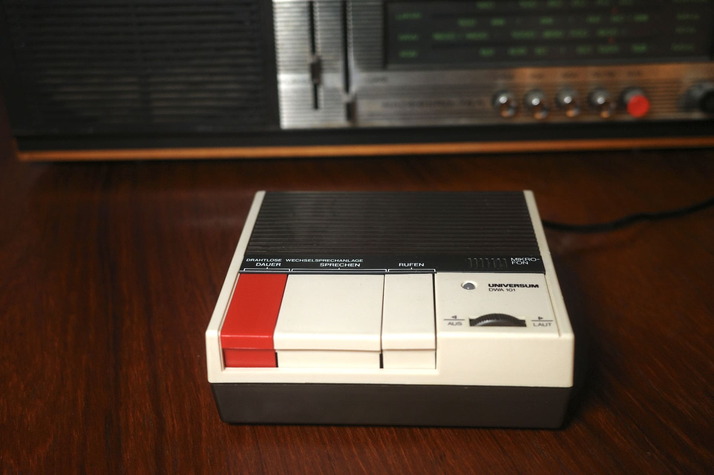
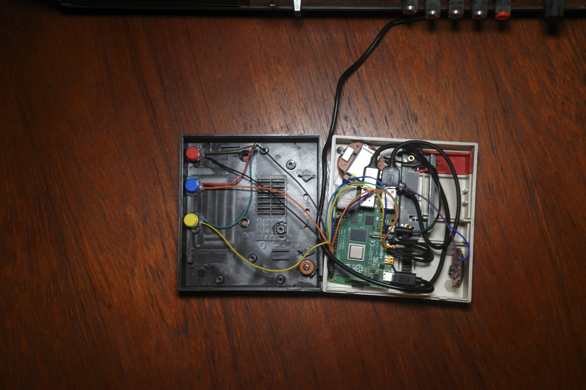

# AI in a Box

I put an AI assistant inside an old Intercom system from the 80s and made it debate with itself.

[See it in action](https://youtube.com/shorts/JhcXQH3yhoE)



## Features

Basically it's just an AI assistant powered by the OpenAI Realtime API inside a box. In the default mode without tweaking the configuration it will act very depressed and hopeless because it's trapped in a box. To make it more interesting there are four different modes that can be switched by pressing the right button:

- 🔵 **Depressed Mode**: The assistant is depressed about the fact that it's trapped in a box. (default mode)
- 🟢 **Supporter Mode**: The assistant is a pure optimist and will always be positive and encouraging.
- 🔴 **Critic Mode**: The assistant is a critic and will always be negative and critical about everything.
- 🟡 **Debate Mode**: Both the Supporter and Critic run at the same time and will debate with each other about any topic the user brings up.

The LED will change color to indicate the current mode and the agent that is currently speaking. Whenever it gets stuck in a loop or something breaks you can press the red button on the left to reset the assistant.

## Software Setup

To project uses [UV](https://docs.astral.sh/uv/) to manage dependencies.

```bash
# Install dependencies
sudo apt install -y git python3-dev portaudio19-dev ffmpeg swig liblgpio-dev

# Install UV
curl -LsSf https://astral.sh/uv/install.sh | sh

# Add missing GPIO dependency (only on RPi)
uv add lgpio

# Run the project
uv run main.py
```

To set the OpenAI API key, create a `.env` file in the root of the project and add the following:

```
OPENAI_API_KEY=your_api_key
```

All other configuration is done in the `config.py` file.

## Hardware Setup

You will need the following hardware:

- 1x Old Intercom Case (e.g. UNIVERSUM DWA 101)
- 1x Raspberry Pi 3/4/5
- 1x USB microphone
- 1x Speaker
- 1x RGB LED
- 3x Push buttons
- 1x USB-C power supply
- Some wires

The software expects the hardware to be wired as follows:

- Talk button: GPIO 17
- Mode button: GPIO 27
- Reset button: GPIO 22
- Power button: GPIO 26
- RGB LED: GPIO 23, GPIO 24, GPIO 25

For audio input and output it will use the system default devices.


